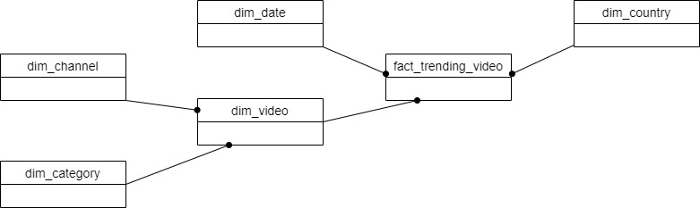
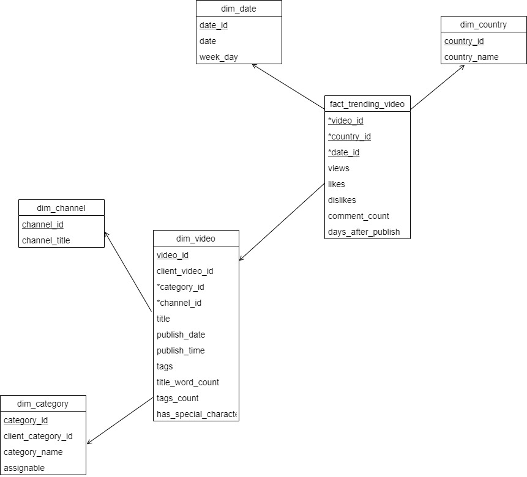

# Conceptual Model

---
The entities identified for the system are:
1. Video - for individual video content
2. Category - for each category
3. Country - for each country
4. Date - trending dates
5. Channel - for individual channels
6. Trend - for trending videos

Identification of facts and dimensions:
* Date as dimension 
* Category as dimension
* Country as dimension
* Channel as dimension
* Video as slowly changing dimension (video details can be updated)
* Trend as a fact

Note: Video has been separated from trending videos fact table as facts usually contain only quantitative information that is needed for analysis.

<i>Conceptual Model schema</i>

# Physical Model

---
Now, we identify the required attributes, datatypes and necessary constraints for the model.

|Attribute      |Domain      |Datatype
|---------------|------------|--------------
|  **dim_date**             |            |   
|date_id               | Unique identifier for dimension date table           |   AUTO INCREMENT, PRIMARY KEY
|date      |     A trending date       |DATE, NOT NULL
|week_day      |    The day of the week ranging any from Sunday to Saturday       |VARCHAR, NOT NULL
|  **dim_country**             |            |   
|country_id               | Unique identifier for dimension country table           |   AUTO INCREMENT, PRIMARY KEY
|country_name      |   Name of the country        |VARCHAR, NOT NULL, UNIQUE
|  **dim_channel**             |            |   
|channel_id               | Unique identifier for dimension channel table           |   AUTO INCREMENT, PRIMARY KEY
|channel_title      |   Title of the channel        |VARCHAR, NOT NULL, UNIQUE
|  **dim_category**             |            |   
|category_id               | Unique identifier for dimension category table           |   AUTO INCREMENT, PRIMARY KEY
|client-category_id  | Client supplied category id           |   INT
|category_name      |   Name of the category        |VARCHAR, NOT NULL
|assignable      |   Assignable status of the category        |Boolean, NOT NULL
|  **dim_video**             |            |   
|video_id               | Unique identifier for dimension video table           |   AUTO INCREMENT, PRIMARY KEY
|client-video_id  | Client supplied video id           |   VARCHAR,NOT NULL
|category_id      |   Id of the category      |INT, FOREIGN KEY, NOT NULL
|channel_id      |   Id of the channel      |INT, FOREIGN KEY, NOT NULL
|title  | title of the video          |   VARCHAR,NOT NULL
|publish_date  | date the video is published         |   DATE,NOT NULL
|publish_time  | time when the video is published        |   TIME,NOT NULL
|tags  | tags used in the video       |   VARCHAR,NOT NULL
|title_word_count  | Total words used in the title       |   INT,NOT NULL
|tags_count  | Total tags used in the video       |   TEXT,NOT NULL
|has_special_character      |   Check if the title has any special character       |Boolean, NOT NULL
|  **fact_trending_video**             |            |   
|video_id               | Id of the dim_video|   INT,PRIMARY KEY, FOREIGN KEY
|country_id               | Id of the dim_country|   INT,PRIMARY KEY, FOREIGN KEY
|date_id               | Id of the dim_date|   INT,PRIMARY KEY, FOREIGN KEY
|views  | views of the video |   INT,NOT NULL
|likes  | likes of the video |   INT,NOT NULL
|dislikes  | dislikes of the video |   INT,NOT NULL
|comment_count  | total comments on the video |   INT,NOT NULL
|days_after_publish  | Total days difference between publish and trending date |   INT,NOT NULL

<i>Physical Model schema</i>

