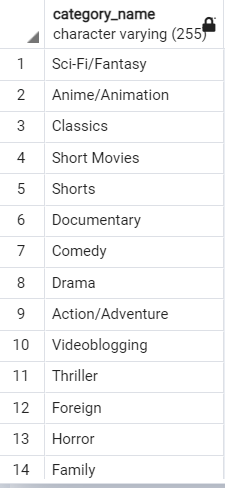
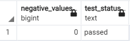

##Data Validation

1. Check if all the categories given by the client have a video
~~~sql
SELECT
    COUNT(*) AS unused_categories,
    CASE
        WHEN COUNT(*) > 1 THEN 'failed'
        ELSE 'passed'
    END AS test_status
FROM dim_category
WHERE category_id NOT IN (SELECT category_id FROM dim_video);
~~~

2. Check if all distinct videos have been added to dimension video

~~~sql
SELECT 
CASE 
WHEN COUNT(distinct(r.client_video_id))<>COUNT(DISTINCT d.client_video_id) THEN 
'failed' ELSE 'passed' END 
FROM video r
JOIN dim_video d
ON d.client_video_id= r.client_video_id
;
~~~

3. Check if all the views,likes,comments and disliked are positive numbers
~~~sql
SELECT
    COUNT(*) AS negative_values,
    CASE
        WHEN COUNT(*) > 0 THEN 'failed'
        ELSE 'passed'
    END AS test_status
FROM fact_trending_video
WHERE views<0 OR likes<0 OR dislikes<0 OR comment_count<0;
~~~

4. Check if all trending videos are unique

~~~sql
SELECT
    COUNT(*) AS negative_values,
    CASE
        WHEN COUNT(*) > 0 THEN 'failed'
        ELSE 'passed'
    END AS test_status
FROM fact_trending_video v
WHERE v.video_id IN (SELECT f.video_id FROM fact_trending_video f 
					 GROUP BY video_id,country_id,date_id
					HAVING count(*)>1);
~~~

