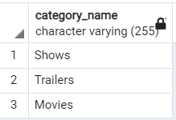

# Data Validation

1. Check if all the categories given by the client have a video
~~~sql
SELECT
    COUNT(*) AS unused_categories,
    CASE
        WHEN COUNT(*) > 1 THEN 'failed'
        ELSE 'passed'
    END AS test_status
FROM dim_category
WHERE category_id NOT IN (SELECT category_id FROM dim_video);
~~~

2. Check if all distinct videos have been added to dimension video

~~~sql
SELECT 
CASE 
WHEN COUNT(distinct(r.client_video_id))<>COUNT(DISTINCT d.client_video_id) THEN 
'failed' ELSE 'passed' END 
FROM video r
JOIN dim_video d
ON d.client_video_id= r.client_video_id
;
~~~

3. Check if all the views,likes,comments and disliked are positive numbers
~~~sql
SELECT
    COUNT(*) AS negative_values,
    CASE
        WHEN COUNT(*) > 0 THEN 'failed'
        ELSE 'passed'
    END AS test_status
FROM fact_trending_video
WHERE views<0 OR likes<0 OR dislikes<0 OR comment_count<0;
~~~

4. Check if all trending videos are unique

~~~sql
SELECT
    COUNT(*) AS negative_values,
    CASE
        WHEN COUNT(*) > 0 THEN 'failed'
        ELSE 'passed'
    END AS test_status
FROM fact_trending_video v
WHERE v.video_id IN (SELECT f.video_id FROM fact_trending_video f 
					 GROUP BY video_id,country_id,date_id
					HAVING count(*)>1);
~~~

5. Check if any video has no tag.

~~~sql
SELECT
    COUNT(*) AS negative_values,
    CASE
        WHEN COUNT(*) > 0 THEN 'failed'
        ELSE 'passed'
    END AS test_status
FROM fact_trending_video v
WHERE v.video_id IN (SELECT f.video_id FROM fact_trending_video f 
					 GROUP BY video_id,country_id,date_id
					HAVING count(*)>1);
~~~

6. Check if publish date is greater than trending date of any video

~~~sql
SELECT
    COUNT(*) AS invalid_date,
    CASE
        WHEN COUNT(*) > 0 THEN 'failed'
        ELSE 'passed'
    END AS test_status
FROM fact_trending_video
WHERE days_after_publish<0;
~~~

7. Check if there are any video information trending before 2017

~~~sql
SELECT
    COUNT(*) AS invalid_date,
    CASE
        WHEN COUNT(*) > 0 THEN 'failed'
        ELSE 'passed'
    END AS test_status
FROM fact_trending_video f
JOIN dim_date d
ON d.date_id = f.date_id
WHERE extract(year from d.date)<2017;
~~~

8. Check if any category with false assignable has a video

~~~sql
SELECT
    COUNT(*) AS false_assignable,
    CASE
        WHEN COUNT(*) > 0 THEN 'failed'
        ELSE 'passed'
    END AS test_status
FROM dim_video d
JOIN dim_category c
ON c.category_id = d.category_id
WHERE c.assignable = false;
~~~

