# Data Visualization 

1. Likes based on week days

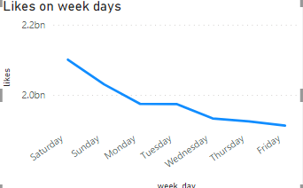
   
2. Views based on week days 

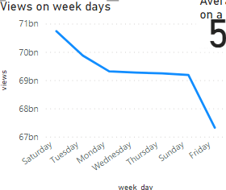
   
3. Week day trending videos

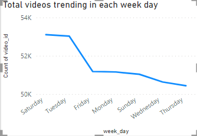
   

4. Trending videos trend 2017,2018

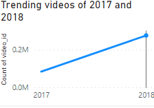
   
5. Trending videos views 2017,2018

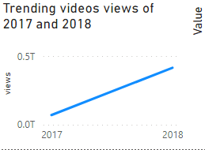
   
6. Average number of tags used in a video

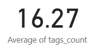
   
7. Average number of words used in a video title

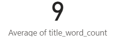
   
8. Average dislikes in a trending video

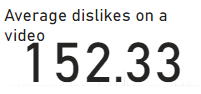
   
9. Average likes in a trending video

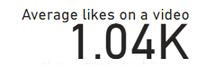
   
10. Average views in a trending video

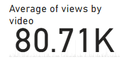
    
11. Top 10 channels with most views

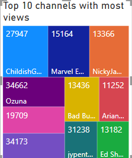
    
12. Top 10 most old videos that are still trending

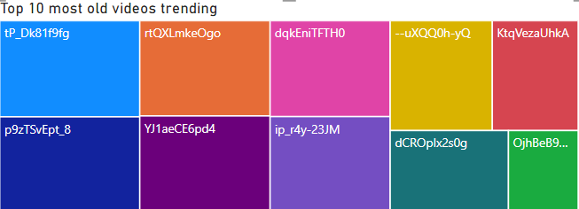

13. Top 10 channels with most trending videos

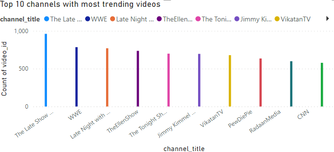
    
14. Trending videos title containing special characters or not

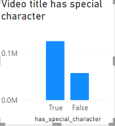
    
15. Top 10 most used words in title

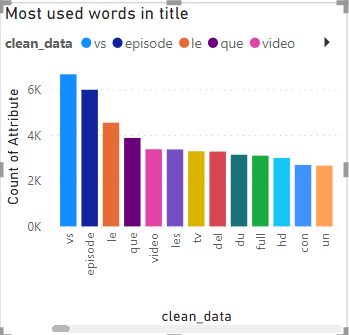
    
16. Top 10 most used tags

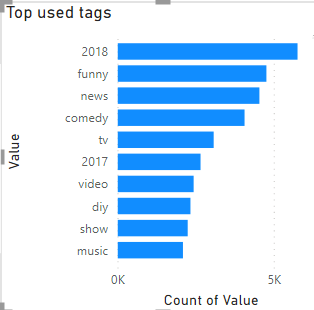
    
17. Likes by country

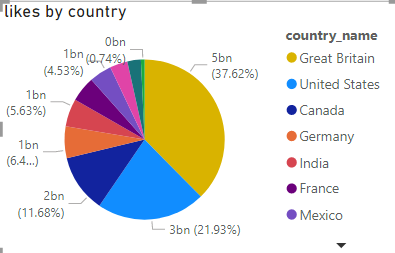
    
18. Relationship between likes,views,dislikes and comments

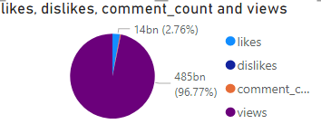
    
19. Dislikes by countries

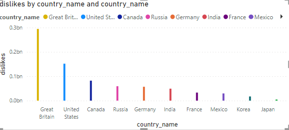
    
20. Comments by country

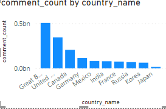

21. Views by country

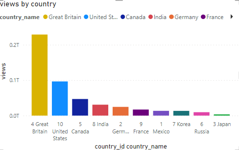

22. Views by category

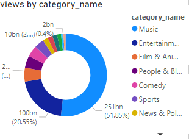
    
23. Likes by category

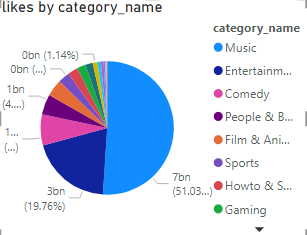
    
24. Dislikes by category

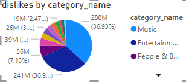
    
25. Comments by category

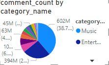

26. Trending videos by country

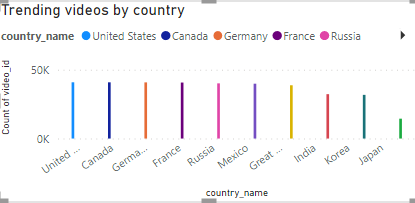

27. Top 10 videos by views

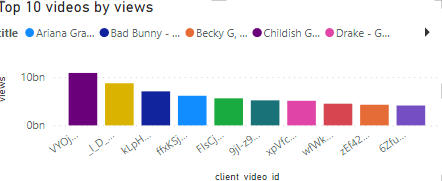
    
28. Top 10 videos by likes

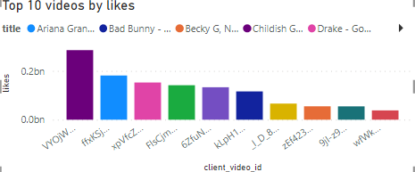

29. Average views by country

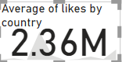

30. Average likes by country

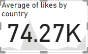